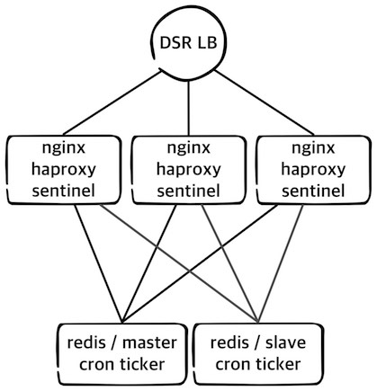

server setup
===================================




# Web(nginx / haproxy / sentinel)
* nginx / openresty
```
!
apt-get install libpcre++-dev
!
wget https://openresty.org/download/openresty-1.11.2.1.tar.gz
tar -xzvf openresty-1.11.2.1.tar.gz

!
./configure \
--with-http_addition_module \
--with-http_stub_status_module \
--with-http_sub_module \
--with-http_ssl_module \
--without-http_autoindex_module \
--without-http_xss_module \
--without-lua_cjson \
--with-pcre-jit \
--with-http_iconv_module \
--with-luajit \
--prefix=/usr/local 


make
make install
```

 - conf
 ```
        location = /api/v1/btcusd {
                default_type application/json;
                set $redis_key 'TICKER:key_btc_price';
                redis_pass 127.0.0.1:16379;
        }

        location = /api/v1/dashusd {
                default_type application/json;
                set $redis_key 'TICKER:key_dash_usd_price';
                redis_pass 127.0.0.1:16379;
        }
        location = /api/v1/dashbtc {
                default_type application/json;
                set $redis_key 'TICKER:key_dash_btc_price';
                redis_pass 127.0.0.1:16379;
        }
 ```


* haproxy
```
wget http://www.haproxy.org/download/1.6/src/haproxy-1.6.8.tar.gz
tar xfvz haproxy-1.6.8.tar.gz
cd haproxy-1.6.8
make TARGET=linux2628
make install


! /etc/rsyslog.conf 
$ModLoad imudp
$UDPServerRun 514

! /etc/rsyslog.d/haproxy.conf 
local2.=info	/var/log/haproxy-access.log
local2.notice	/var/log/haproxy-info.log
```

 - conf
 ```
global
 log         127.0.0.1 local2
 chroot      /var/lib/haproxy
 pidfile     /var/run/haproxy.pid
 maxconn     4000
 user        haproxy
 group       haproxy
 daemon

defaults
 log global
 mode tcp
 timeout connect  4s
 timeout server  30s
 timeout client  30s
 
frontend ft_redis
 bind 127.0.0.1:16379 name redis
 default_backend bk_redis
 
backend bk_redis
 option tcp-check
 tcp-check comment PING\ phase
 tcp-check send PING\r\n
 tcp-check expect string +PONG
 tcp-check comment role\ check
 tcp-check send info\ replication\r\n
 tcp-check expect string role:master
 tcp-check comment QUIT\ phase
 tcp-check send QUIT\r\n
 tcp-check expect string +OK
 server R1 192.168.10.1:6379 check inter 1s
 server R2 192.168.10.2:6379 check inter 1s
 ```


* sentinel
```
apt-get install redis-server
cd /etc/redis/
mv sentinel.conf redis.conf 
```

```
!/etc/init.d/redis-server
!/lib/systemd/system/redis-server.service 

: add --sentinel

systemctl daemon-reload
```

```
chown redis /etc/redis/redis.conf 
```

```
vm.overcommit_memory = 1 to sysctl.conf
sysctl -p
```

- conf
```
!redis.conf 
port 26379
dir "/tmp"
sentinel monitor mymaster 192.168.10.1 6379 2
sentinel down-after-milliseconds mymaster 10000
daemonize yes
pidfile "/var/run/redis/redis-server.pid"
logfile "/var/log/redis/redis-server.log"
maxclients 4064
```


- DRS
```
!/etc/network/interfaces
auto lo:0
iface lo:0 inet static
address 111.111.111.111
netmask 255.255.255.255

ifup lo:0

!/etc/default/iptables
-A PREROUTING -d 111.111.111.111/32 -j REDIRECT

! nginx reload
```


# redis /cron
- slave
```
slaveof 192.168.10.1 6379
```

- cron 
 https://github.com/chaeplin/dash-price
